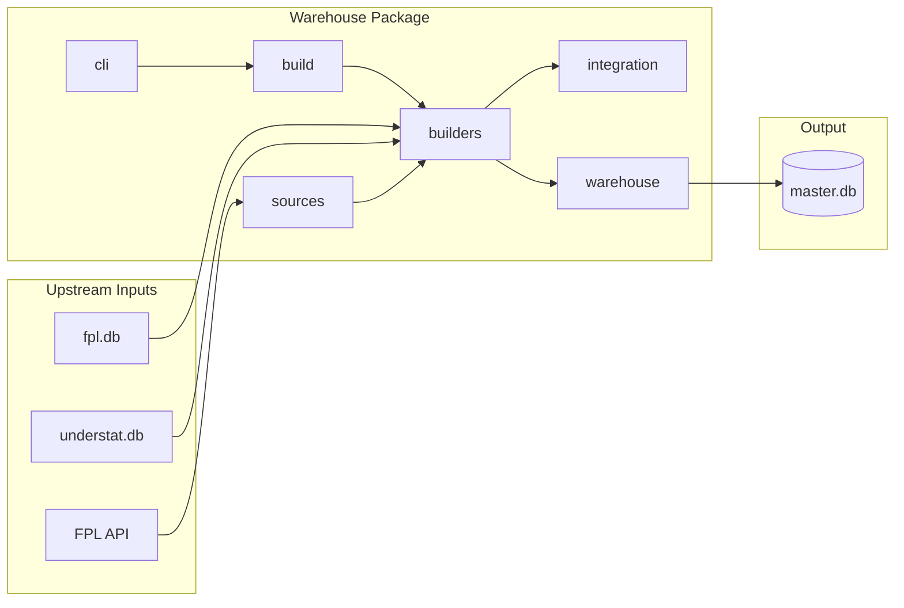
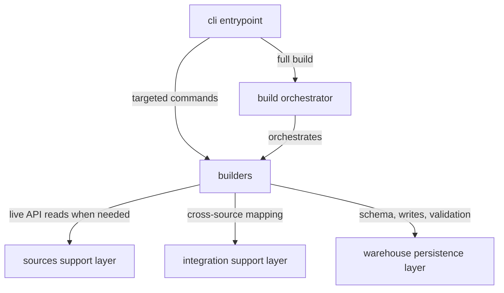
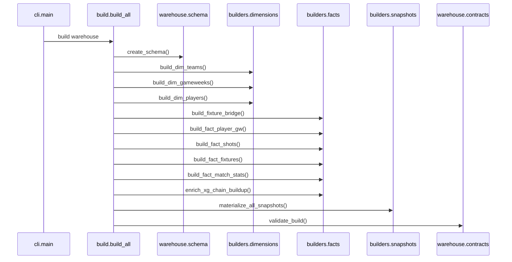
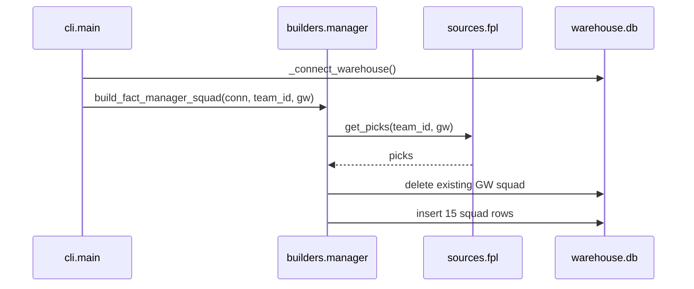
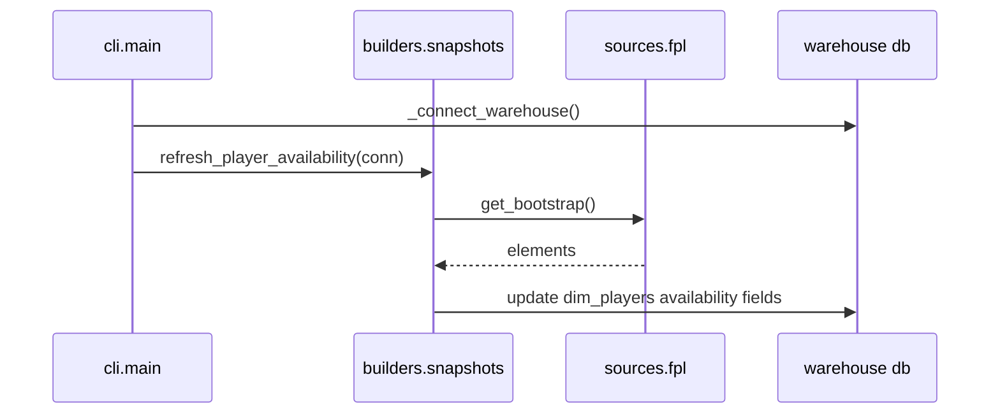

# Architecture

This page gives a simple view of the main warehouse runtime structure and workflows.

## Legend

- Entry point: starts execution.
- Work layer: performs data loading or materialization.
- Support layer: helps a work layer with external reads or cross-source mapping.
- Persistence layer: owns database, schema, and validation.
- Orange solid arrows: orchestration or direct runtime control flow.
- Blue dashed arrows: support-layer calls or helper dependencies.
- Green solid arrows: persistence or warehouse ownership flow.
- Purple dotted arrows: upstream external inputs.

In this repo, `sources` means live API sources only. The SQLite source
databases, `fpl.db` and `understat.db`, are upstream inputs read directly
by `builders` and `integration`.

## System Boundaries

This diagram shows external inputs, package boundaries, and where data ends up.
It does not define implementation construction rules or the canonical materialization sequence.

## Execution And Dependency Layout

Execution starts in `cli` or direct calls into `build` and `builders`.
`sources` and `integration` do not start work themselves. They support
the builder layer when external data or cross-source mapping is needed.

This diagram shows runtime call and dependency direction.

## Full Warehouse Build

## Manager Squad Refresh

This is an optional operational workflow for persisted manager-specific state.
It is not part of the governed warehouse snapshot contract.

## Availability Refresh

This refresh path updates live current-state player availability fields only.
Historical warehouse facts remain rebuild-owned and are refreshed through the scheduled source refresh plus full warehouse rebuild path.
